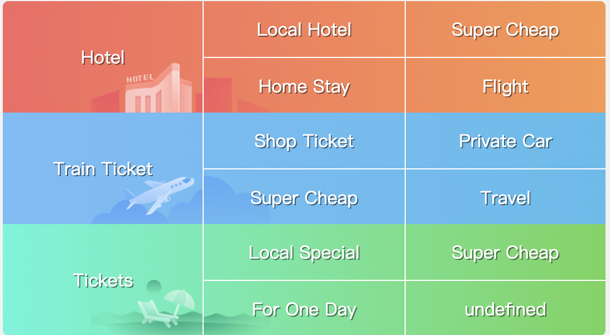

# Mobile Ticket Site


### FLex Layout



### FOR Loop and Function
```js
 function changeSpritesPosition(className) {
        let pics = document.querySelectorAll(className);

        for (let i = 0; i < pics.length; i++) {

            let index = i * pics[i].offsetHeight;
        
            pics[i].style.backgroundPosition = `0 ${-index}px`;
        }
    };

    changeSpritesPosition('.icon-pic')
```

### 背景色线性渐变

```css
background: -webkit-linear-gradient(left, orange, purple)
```